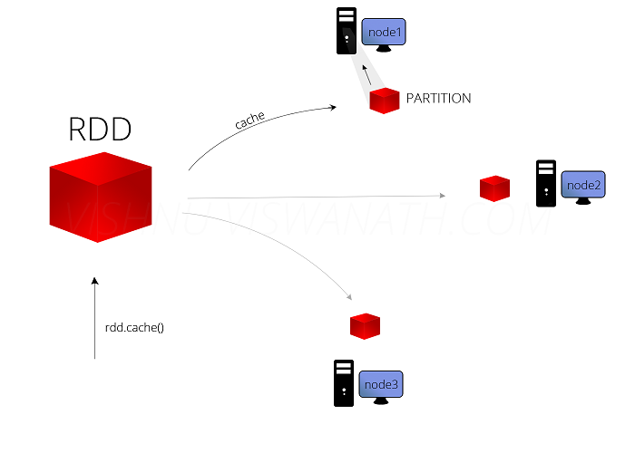
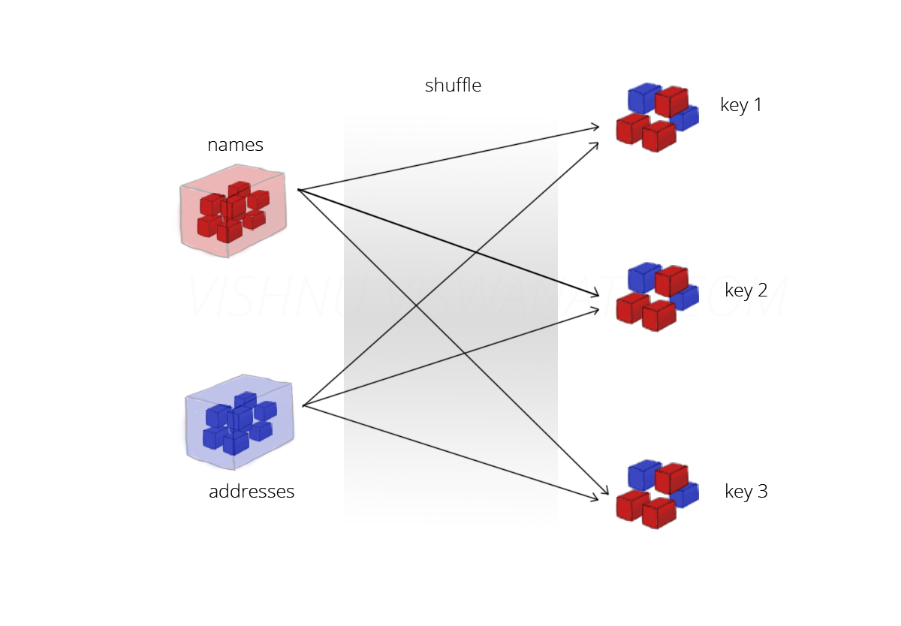

# Spark Interview Questions And Answers
So, here is the Spark Interview Questions list which contains all types of interview Questions asked in Spark interview.

**Q1. What is Apache Spark?**

**Ans.** Apache Spark is a lightning-fast unified analytics engine for big data and machine learning. 

	- It has an expressive APIs to efficiently execute streaming as well as the batch. 
	- It provides faster and more general data processing platform engine. 
	- It is basically designed for fast computation. 
	- It was developed at UC Berkeley in 2009. 
	- It distributes data in file system across the cluster, and process that data in parallel. 
	- It covers a wide range of workloads like batch applications, iterative algorithms, 
	  interactive queries and streaming. 
	- It lets you write an application in Java, Python or Scala.
	- It was developed to overcome the limitations of MapReduce cluster computing paradigm. 
	- Spark keeps things in memory whereas map reduce keep shuffling things in and out of disk. 
	- It allows to cache data in memory. 
	- Spark is easier to develop as it knows how to operate on data. It supports SQL queries, 
	  streaming data as well as graph data processing. 
	- Spark doesn’t need Hadoop to run, it can run on its own using other storages like Cassandra, 
	  S3 from which spark can read and write. 
	- In terms of speed spark run programs up to 100x faster in memory or 10x faster on disk than Map Reduce.

**Q2. What is the need of Apache Spark?**

**Ans.**  Basically, we had so many general purpose cluster computing tools. 

For example:

	- Hadoop MapReduce
	- Apache Storm
	- Apache Impala
	- Apache Storm
	- Apache Giraph and many more. 
But each one has some limitations in their functionality as well. Such as:

	1. Hadoop MapReduce can only allow for batch processing.
	2. If we talk about stream processing only Apache Storm / S4 can perform.
	3. Again for interactive processing, we need Apache Impala / Apache Tez.
	4. While we need to perform graph processing, we opt for Neo4j / Apache Giraph.

Therefore, No single engine can perform all the tasks together. hence there was a big demand for a powerful engine that can process the data in real-time (streaming) as well as in batch mode
Also, which can respond to sub-second and perform in-memory processing

**Q3. What are the components of Spark Ecosystem?**

**Ans.** Apache spark consists of following components:

	1.Spark Core
	2.Spark SQL
	3.Spark Streaming
	4.MLlib
	5.GraphX

**Spark Core:** Spark Core contains the basic functionality of Spark, including components for task scheduling, memory management, fault recovery, interacting with storage systems, and more. Spark Core is also home to the API that defines resilient distributed datasets (RDDs), which are Spark’s main programming abstraction.It also provides many APIs for building and manipulating these RDDS.

**Spark SQL:** Spark SQL provides an interface to work with structured data.It allows querying in SQL as well as Apache Hivevariant of SQL(HQL).It supports many sources.

**Spark Streaming:** It is spark component that enables processing of live streams of data.

**MLlib:** Spark comes with common machine learning package called MLlib

**GraphX:** GraphX is a library for manipulating graphs (e.g., a social network’s friend graph)and performing graph-parallel computations.

**Q4. what is the basic data structure of Apache Spark Core?**

**Ans.** Spark Core is the fundamental unit of the whole Spark project. It provides all sort of functionalities like

	- Task dispatching
	- Scheduling
	- Input-output operations etc.
	
Spark makes use of Special data structure known as **RDD (Resilient Distributed Dataset)**. It is the home for API that defines and manipulate the RDDs. 

All the basic functionality of Apache Spark Like 

	- In-memory computation 
	- Fault tolerance
	- Memory management
	- Monitoring
	- Task scheduling 
	
is provided by Spark Core. Apart from this Spark also provides the basic connectivity with the data sources. For example, HBase, Amazon S3, HDFS etc.

**Q5.What are the benefits of Apache Spark over Apache Hadoop?**

**Ans.** Apache Spark is lightening fast cluster computing tool. It is up to 100 times faster than Hadoop MapReduce due to its very fast in-memory data analytics processing power.

Apache Spark surpasses Hadoop in many cases such as

	1. Processing the data in memory which is not possible in Hadoop.
	2. Processing the data that is in batch, iterative, interactive & streaming i.e. Real Time mode. 
	   Whereas Hadoop processes only in batch mode.
	3. Spark is faster because it reduces the number of disk read-write operations.
	   Whereas in Hadoop MapReduce intermediate output which is output of Map() is always written 
	   on local hard disk.
	4. Apache Spark is easy to program as it has hundreds of high-level operators 
	   with RDD (Resilient Distributed Dataset).
	5. Apache Spark code is compact due compared to Hadoop MapReduce. 
	   Use of Scala makes it very short, reduces programming efforts. 
	   Also, Spark provides rich APIs in various languages such as Java, Scala, Python, and R.
	6. Spark & Hadoop are both highly fault-tolerant.
	7. Spark application running in Hadoop clusters is up to 10 times faster on disk than Hadoop MapReduce.
	
	

**Spark vs Hadoop**

| Criteria | Hadoop MapReduce | Apache Spark |
| --- | --- | --- |
| Memory | Does not leverage  the memory of the  hadoop cluster to maximum. | Let's save data on memory with the use of RDD's. |
| Disk usage | MapReduce is disk oriented. | Spark caches data in-memory and ensures low latency. |
| Processing | Only batch processing is supported | Supports real-time processing through spark streaming.|
| Installation |Is bound to hadoop | Is not bound to Hadoop |

**Q6. What are the different methods to run Spark over Apache Hadoop?**

**Ans.**  Instead of MapReduce we can use spark on top of Hadoop ecosyste

	- Spark with HDFS
	        you can read and write data in HDFS
	- Spark with Hive
		you can read and analyse and write back to the hive
**Q7. What is SparkContext in Apache Spark?**

**Ans.** A SparkContext is a client of Spark’s execution environment and it acts as the master of the Spark application. SparkContext sets up internal services and establishes a connection to a Spark execution environment. You can create RDDs, accumulators and broadcast variables, access Spark services and run jobs (until SparkContext stops) after the creation of SparkContext. Only one SparkContext may be active per JVM. You must stop() the active SparkContext before creating a new one.

The SparkContext allows the Spark driver application to access the cluster through a resource manager. The resource manager can be YARN, or Spark’s Cluster Manager.

**Few functionalities which SparkContext offers are:**

	1. We can get the current status of a Spark application like configuration, app name.
	2. We can set Configuration like master URL, default logging level.
	3. One can create Distributed Entities like RDDs.
	
**Q8.**Various ways to create contexts in spark ?**

**Ans.** below are the verious way to create context

	a. Sparkconext
	b. Sqlcontext
	c. Sparksession
	d. Sqlcontext.sparkcontext
	
**set up the spark configuration and create contexts**

	val sparkConf = new SparkConf().setAppName("SparkSessionExample").setMaster("local")
	
**to SparkContext to access other context like SQLContext**

	val sc = new SparkContext(sparkConf).set("spark.some.config.option", "some-value")
        val sqlContext = new SQLContext(sc)
	
**Whereas in Spark 2.0 the same effects can be achieved through SparkSession, without expliciting creating SparkConf, SparkContext or SQLContext, as they’re encapsulated within the SparkSession. 

	val warehouseLocation = "file:${system:user.dir}/spark-warehouse"
	val spark = SparkSession
   	.builder()
   	.appName("SparkSessionsExample")
   	.config("spark.sql.warehouse.dir", warehouseLocation)
   	.enableHiveSupport()
   	.getOrCreate()
	
**Q9. What is RDD?**

**Ans.** RDDs (Resilient Distributed Datasets) are basic abstraction in Apache Spark that represent the data coming into the system in object format. RDDs are used for in-memory computations on large clusters, in a fault tolerant manner. RDDs are read-only portioned, collection of records, that are:

	-Resilient because RDDs are immutable(can’t bemodified once created) and fault tolerant
	 (If a node holding the partition fails the other node takes the data). 
	-Distributed because it is distributed across cluster.
	-Dataset because it holds data.
	
RDDs are automatically distributed across the network by means of Partitions. 
	
	-RDDs are divided into smaller chunks called Partitions, and when you execute some action,
	 a task is launched per partition. 
	-These partitions of an RDD is distributed across all the nodes in the network.
	
**Actions/Transformations:**
There are two types of operations that you can perform on an RDD- Transformations and Actions.

	Transformation:
        -Applies some function on a RDD and creates a new RDD, it does not modify the RDD that you apply 
	 the function on. (Remember that RDDs are resilient/immutable).
    	-Also, the new RDD keeps a pointer to it’s parent RDD.
	
 

When you call a transformation, Spark does not execute it immediately, instead it creates a lineage. A lineage keeps track of what all transformations has to be applied on that RDD, including from where it has to read the data. For example, consider the below example

	val rddTextFile = sparkSession.sparkContext.textFile("src/main/resources/bank-names.txt", 2)
	val rddContainNumber = rddTextFile.filter(line => line.contains("Number")) //transformation
  	println(rddTextFile.toDebugString)
  	println(rddContainNumber.toDebugString)
  	print(rddContainNumber.count())

* sparkSession.sparkContext.textFile() and rddTextFile.filter() do not get executed immediately.
* It will only get executed once you call an Action on the RDD - here rddContainNumber.count().
* An Action is used to either save result to some location or to display it.
* You can also print the RDD lineage information by using the command filtered.toDebugString(filtered is the RDD here).
	
**Caching**
You can cache an RDD in memory by calling rdd.cache(). When you cache an RDD, it’s Partitions are loaded into memory of the nodes that hold it.

	rddContainNumber.cache()
   	println(rddContainNumber.toDebugString)

Caching can improve the performance of your application to a great extent. In the previous section you saw that when an action is performed on a RDD, it executes it’s entire lineage. Now imagine you are going to perform an action multiple times on the same RDD which has a long lineage, this will cause an increase in execution time. Caching stores the computed result of the RDD in the memory thereby eliminating the need to recompute it every time. You can think of caching as if it is breaking the lineage, but it does remember the lineage so that it can be recomputed in case of a node failure.

**Persistence**
caching can be used to avoid recomputation of RDD lineage by saving its contents in memory. If there is not enough memory in the cluster, you can tell spark to use disk also for saving the RDD by using the method persist().
 
 	rddContainNumber.persist(StorageLevel.MEMORY_AND_DISK)
	println(rddContainNumber.toDebugString)
	
In fact Caching is a type of persistence with StorageLevel -MEMORY_ONLY. If you use MEMORY_ONLY as the Storage Level and if there is not enough memory in your cluster to hold the entire RDD, then some partitions of the RDD cannot be stored in memory and will have to be recomputed every time it is needed. If you don’t want this to happen, you can use the StorageLevel - MEMORY_AND_DISK in which if an RDD does not fit in memory, the partitions that do not fit are saved to disk.

In the above example, the RDD has 3 partitions and there are 2 nodes in the cluster. Also, memory available in the cluster can hold only 2 out of 3 partitions of the RDD. Here, partitions 1 and 2 can be saved in memory where as partition 3 will be saved to disk.
Another StorageLevel are :
 
 	DISK_ONLY: stores all the partitions on the disk.
	MEMORY_ONLY_SER: serialized before saving to Memory and store the RDDs as serialized java objects.
	MEMORY_AND_DISK_SER: rialized before saving to Memory and disk, and store the RDDs as serialized java objects.

**Q10.Why RDD is immutable ?**
**Ans.** Following are the reasons:

	– Immutable data is always safe to share across multiple processes as well as multiple threads.
	– Since RDD is immutable we can recreate the RDD any time. (From lineage graph).
	– If the computation is time-consuming, in that we can cache the RDD which result in performance improvement.

**Q11. Explain about the different cluster managers in Apache Spark?**
**Ans.** The 3 different clusters managers supported in Apache Spark are:

	Standalone – a simple cluster manager included with Spark that makes it easy to set up a cluster.
	Apache Mesos – a general cluster manager that can also run Hadoop MapReduce and service applications.
	Hadoop YARN – the resource manager in Hadoop 2.
	Kubernetes (experimental) – an open-source system for automating deployment, scaling, and management of 
	containerized applications.
	
Spark applications run as independent sets of processes on a cluster, coordinated by the SparkContext object in your main program,  	  which is called the Driver Program. 

To run on a cluster, SparkContext can connect to several types of Cluster Managers, which allocate resources across applications. 

Once the connection is established, Spark acquires executors on the nodes in the cluster to run its processes, does some 	     	    computations, and stores data for your application.

Next, it sends your application code (defined by JAR or Python files passed to SparkContext) to the executors.

Finally, SparkContext sends tasks to the executors to run.

	
**Standalone Mode**
It is the easiest of all in terms of setup and provides almost all the same features as the other cluster managers if you are only running Spark.
The Spark standalone mode requires each application to run an executor on every node in the cluster, whereas with YARN, you can configure the number of executors for the Spark application.	

**Mesos Mode**
Mesos consists of a master daemon that manages the agent daemons that are running on each cluster node. Mesos framework is responsible for running the tasks on these agents. The master enables fine-grained sharing of resources (CPU, RAM, …) across frameworks by giving them resource offers. The master decides how many resources to offer to each framework according to a given organizational policy, such as fair sharing or strict priority.

A framework running on top of Mesos consists of two components:

	1. A scheduler that registers with the master to be offered resources
	2. An executor process that is launched on agent nodes to run the framework’s tasks

Agent nodes report to master about free resources available to them. The master determines how many resources are offered to each framework and the frameworks’ schedulers select which of the offered resources to be utilized. When a framework accepts the offered resources, it passes a description of the tasks it wants to run on them to Mesos. In turn, Mesos launches the tasks on the corresponding agents.

**Yarn Mode**
Spark with Yarn can be deployed in two modes.

**Cluster Deployment Mode**
In this mode, SparkDriver runs in the Application Master on Cluster host.
A single process in a YARN container is responsible for both driving the application and requesting resources from YARN.

The client that launches the application does not need to run for the lifetime of the application.
Cluster mode is not well-suited for using Spark interactively. Spark applications that require user input, such as spark-shell and pyspark, require the Spark driver to run inside the client process that initiates the Spark application.

**Client Deployment Mode**
In client mode, the Spark driver runs on the host where the job is submitted.

The ApplicationMaster is responsible only for requesting executor containers from YARN. After the containers start, the client communicates with the containers to schedule work.

It supports spark-shell, as the driver runs at the client side.

Standalone is good for small Spark clusters, but it is not good for bigger clusters (there is an overhead of running Spark daemons — master + slave — in cluster nodes). These daemons require dedicated resources. So standalone is not recommended for bigger production clusters.

YARN was created out of the necessity to scale Hadoop. Prior to YARN, resource management was embedded in Hadoop MapReduce V1 and it had to be removed in order to help MapReduce scale. The MapReduce 1 JobTracker wouldn’t practically scale beyond a couple thousand machines. The creation of YARN was essential to the next iteration of Hadoop’s lifecycle, primarily around scaling, whereas Mesos was built to be a scalable global resource manager for the entire data center.

Mesos determines which resources are available, and it makes offers back to an application scheduler (the application scheduler and its executor is called a “framework”). Those offers can be accepted or rejected by the framework. This model is considered a non-monolithic model because it is a “two-level” scheduler where scheduling algorithms are pluggable. Whereas when a job request comes into the YARN resource manager, YARN evaluates all the resources available and it places the job. It’s the one making the decision of where jobs should go; thus, it is modeled in a monolithic way.

**Q12.How can you minimize data transfers when working with Spark?**

**Ans**
Minimizing data transfers and avoiding shuffling helps write spark programs that run in a fast and reliable manner. The various ways in which data transfers can be minimized when working with Apache Spark are:

	- Using Broadcast Variable- Broadcast variable enhances the efficiency of joins between small and large RDDs.
	- Using Accumulators – Accumulators help update the values of variables in parallel while executing.
	- The most common way is to avoid operations ByKey, repartition or any other operations which trigger shuffles.

**Q13  Why is there a need for broadcast variables when working with Apache Spark?**

**Ans** These are read only variables, present in-memory cache on every machine. When working with Spark, usage of broadcast variables eliminates the necessity to ship copies of a variable for every task, so data can be processed faster. Broadcast variables help in storing a lookup table inside the memory which enhances the retrieval efficiency when compared to an RDD lookup ().

Let us first understand why we need a broadcast variable. Take a look at the below example, where names is joined with addresses.

 	val nameRDD = sparkSession.sparkContext.textFile("src/main/resources/name.txt", 2)
    				  .map(line => (line.split(",")(0), line))
  	val addressRDD = sparkSession.sparkContext.textFile("src/main/resources/address.txt", 2)
                                     .map(line => (line.split(",")(0), line))
	val joinedRDD = nameRDD.join(addressRDD)
	
Here, both names and addresses will be shuffled over the network for performing the join which is not efficient since any data transfer over the network will reduce the execution speed.

So how do we overcome this problem? By means of broadcast variables.

  	val addressesMap = addressRDD.collect().toMap
  	val broadcastAddressMap = sparkSession.sparkContext.broadcast(addressesMap)
 	val joinedRDDONBroadcast = nameRDD.map(v => (v._2, broadcastAddressMap.value(v._1)))

If a variable is broadcasted, it will be sent to each node only once, thereby reducing network traffic.
Broadcast variables are read-only, broadcast.value is an immutable object

Spark uses BitTorrent like protocol for sending the broadcast variable across the cluster, i.e., for each variable that has to be broadcasted, initially the driver will act as the only source. The data will be split into blocks at the driver and each receiver will start fetching the block to it’s local directory. Once a block is completely received, then that reciver will also act as a source for this block for the rest of the reciver (This reduces the load at the machine running driver). 

This is continued for rest of the blocks. So initially, only the driver is the source and later on the number of sources increases - because of this, rate at which the blocks are fetched by a node increases over time.

**Q13  Why is there a need for Accumulators when working with Apache Spark?**

**Ans** Accumulators, as the name suggests accumulates data during execution. This is similar to Counters in Hadoop MapReduce. An accumulator is initialized at the driver and is then modified (added) by each executors. Finally all these values are aggregated back at the driver.

 	val accumulator = sparkSession.sparkContext.accumulator(0,"india_counter")
	joinedRDDONBroadcast.foreach(v => if(v._2.contains("India")) accumulator +=1)

	we cannot do below operations on accumulators of the type Int
 	joinedRDDONBroadcast.foreach(v => if(v._2.contains("India")) accumulator -= 1) 
  	joined.foreach(v=> if (v._2.contains("india")) accum *= 1)
 	 //error: value *= is not a member of org.apache.spark.Accumulator[Int]

